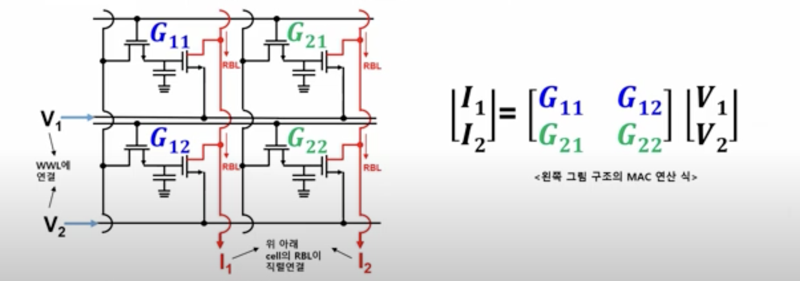

# An Analog Circuit Training A Multi-Layer Perceptron

Recent work following [Scellier and Bengio (2016)](https://arxiv.org/abs/1602.05179) and [Kendall et al. (2018)](https://arxiv.org/abs/2006.01981) has shown that, at least in theory, it is possible to train a multi-layer perceptron (MLP) fully in analog, computing gradient updates which take into account device non-idealities, using the equilibrium propagation algorithm. A fully analog neural network accelerator, performing a type of in-memory computing, would be capable of training neural networks 1000-1Mio times faster than GPUs, with similarly lower energy consumption, as it is not subject to the Von-Neumann bottleneck. 

The original works have focused on Memristors as programmable synapses, which are still experimental, subject to degradation and not yet mass-producable. I was interested to see how well a circuit using regular transistors could work, where the memristor crossbar arrays would be replaced with a standard 2T1C DRAM array, which are already mass-produced. While transistors would introduce significant non-linearity, this does not have to be a problem since neural networks don't require linear synapses, and since the equilibrium propagation gradients automatically take non-linearities into account.

The circuit above is capable of performing (the equilibrium-propagation equivalent of) a forward and backward pass of a 3-layer MLP, but it's not showing any of the surrounding control circuitry. The figure is modified from [Scellier (2024)](https://arxiv.org/abs/2402.11674). The core difference to the original circuit is that I'm using regular transistors as (nonlinear) parametrized synaptic conductances, where the weights are represented by gate voltages stored in capacitors. Adding some control circuitry and arranging the weight matrix in a crossbar array structure, we see that our analog multiply-and-accumulate operation is essentially performed by a standard 2T1C DRAM array. A 2x2 example is shown below:

Using the Skywater 130nm PDK, PySpice and Sandia Lab's Xyce Simulator, I implemented a transient SPICE simulation of a version of this circuit, training an arbitrary MLP end-to-end. It performs both forward and backward passes, computes and applies the equilibrium propagation gradient updates, over randomly sampled datapoints. However, I found that the transistor saturation of the DRAM read transistor caused a physical version of the vanishing gradient problem, passing little update signal to earlier layers. I then replaced the read-nfet of the 2T1C dram cell with a common-source CMOS amplifier, which avoids saturation and significantly improved how well the network learns. As an additional bonus, it is capable of representing negative weights elegantly. 

My circuit (in `analog_circuit.ipynb`) is already capable of fitting a simple sine-wave with a 2-layer network:

but I wasn't yet able to get larger circuits to train reliably against more complex target functions. Biasing the circuit well for optimal learning becomes quite the challenge, and will require an expert electrical engineer with great deep learning intuition. 

Nonetheless, to the best of my knowledge, the simulation above is the first fully transient simulation of end-to-end training of an analog neural network accelerator. Previous works have only computed operating points using SPICE, and computed and applied the gradient updates digitally, outside of the simulation. The benefit of our circuit is that it is fully VLSI compatible, and could operate end-to-end without digital circuitry. Another benefit is that an  end-to-end transient simulation now allows us to add e.g. transient noise sources to the circuit, and get a realistic picture of how well the learned neural network is able to work around the regularizing effect of thermal, flicker, and shot noise. This, and much else, is left for future work.

# How To Run

Installing the relevant software (Xyce and the SkywaterPDK) is a pain. Welcome to the world of electrical engineering. 

Fortunately, there's a docker container setting everything up for you.

The easiest way to build and use it is to open the repo in VSCode, install the Dev Container and Jupyter extensions, and follow the prompts.

Then the notebook should simply run, if you select the python runtime installed in the container.
